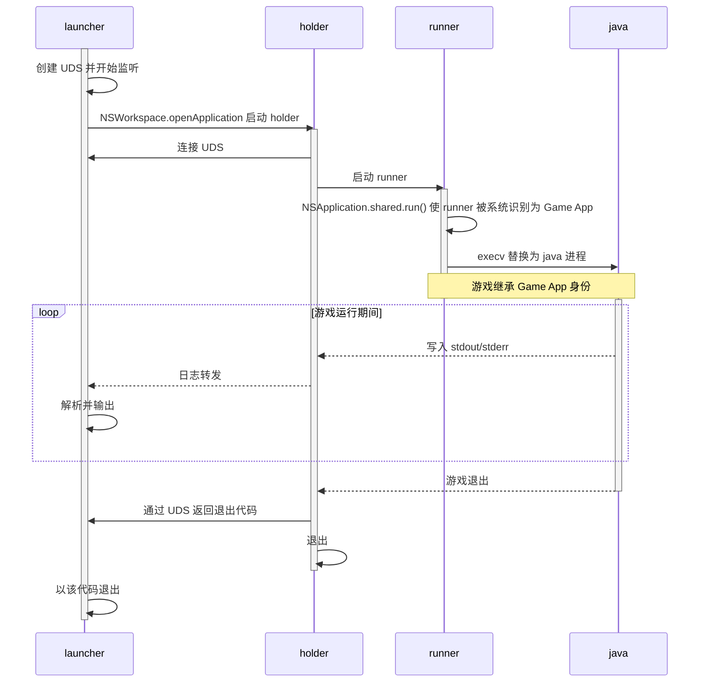

# GameStub

## 简介
GameStub 是一个用 Swift 编写的程序，用于为 Minecraft 等 Java 游戏激活 macOS Game Mode。

## 使用方式

### 面向启动器开发者
在创建游戏进程时，将进程的可执行文件修改为：
```bash
/path/to/GameStub.app/Contents/Resources/launcher
```
并在参数前插入 `java` 的绝对路径即可。

### 对于普通玩家
如果您的启动器支持设置“包装命令”（Wrapper Command），只需将上述路径填入对应字段即可。

## 实现原理
- `launcher`：负责启动 `holder`，由启动器端调用。
- `holder`：负责启动和管理 `runner`，并通过 Unix Domain Socket 向 `launcher` 传输实时日志、退出代码等数据。
- `runner`：负责启动游戏，并使游戏进程继承其 Game App 身份。

### 启动流程


<details>
<summary>
关键实现说明
</summary>

#### 1. 为什么用 `NSWorkspace.openApplication` 启动 `holder`？
当 Game Mode 激活时，macOS 会降低后台 App 的性能。如果 `GameStub` 是其它 *App*（如启动器）的子进程，它和游戏进程的性能也会被降级。<br>
通过 `NSWorkspace.openApplication` 启动 `holder` 可以让它脱离启动器进程树，避免被连带降级。

#### 2. 为什么 `NSApplication.shared.run()` 可以使 `runner` 被系统识别为 Game App？
因为 `runner` 已具备 App Bundle 身份和 Game 类别声明，`NSApplication.shared.run()` 只是让它进入 AppKit 运行状态，使系统将其识别为 Game App。
</details>

## 系统要求
macOS 14.0+（Apple Silicon）<br>
这同时也是 Game Mode 的系统要求。

## 安装

### 从源码构建（使用 `make`）
```bash
git clone https://github.com/CylorineStudio/GameStub.git && cd GameStub
make
```
产物位于 `dist/GameStub.app`。