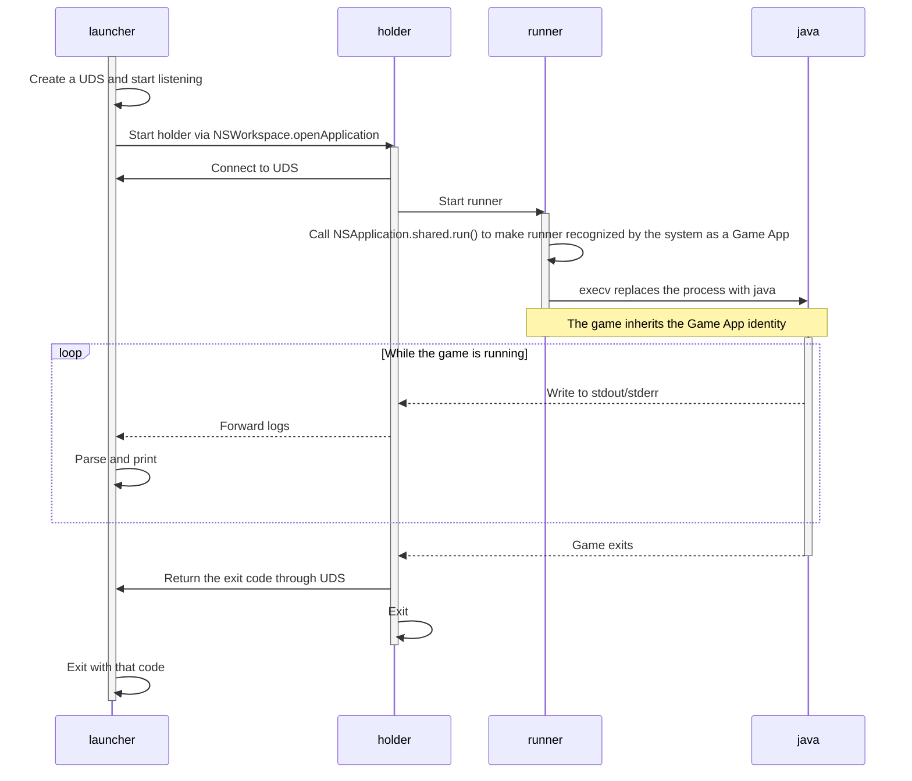

# GameStub

[简体中文](.github/README_zh-CN.md)

## Introduction
GameStub is a Swift program that enables macOS Game Mode for Java games such as Minecraft.

## Usage

### For launcher developers
When creating the game process, replace the executable path with:

```bash
/path/to/GameStub.app/Contents/Resources/launcher
```

and insert the absolute path to `java` before the arguments.

### For regular users
If your launcher supports a “wrapper command”, simply set the field to the path above.

## How it works
- `launcher`: starts `holder` and is invoked by the launcher side.
- `holder` (`runner` in `--holder` mode): starts and manages `runner`, and sends live logs, exit codes, and other data to `launcher` through a Unix Domain Socket.
- `runner`: starts the game and makes the game process inherit its Game App identity.

### Startup flow


<details>
<summary>
Key implementation notes
</summary>

#### 1. Why use `NSWorkspace.openApplication` to start `holder`?
When Game Mode is active, macOS reduces the performance of background apps. If `GameStub` is a child process of another app, such as a launcher, both it and the game process may be throttled.<br>
Starting `holder` via `NSWorkspace.openApplication` lets it escape the launcher process tree and avoids being affected by that throttling.

#### 2. Why can `NSApplication.shared.run()` make `runner` be recognized as a Game App?
Because `runner` already has App Bundle identity and a Game category declaration, `NSApplication.shared.run()` only puts it into AppKit runtime mode, allowing the system to recognize it as a Game App.
</details>

## System Requirements
macOS 14.0+ (Apple Silicon)<br>
This is also the system requirement for Game Mode.

## Installation

### Build from source (using `make`)
```bash
git clone https://github.com/CylorineStudio/GameStub.git && cd GameStub
make
```

The build artifact is located at `dist/GameStub.app`.